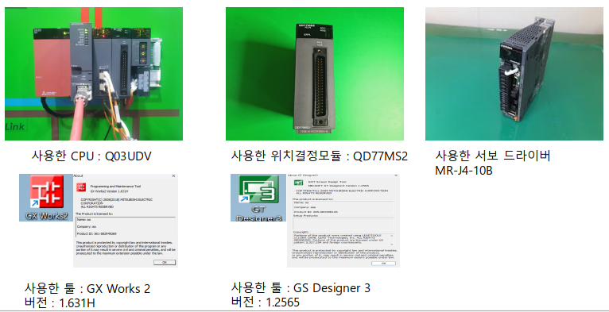
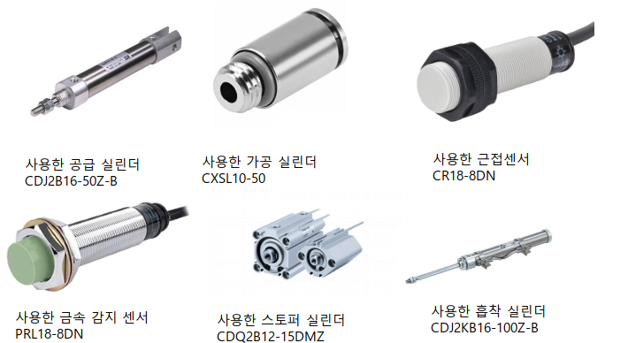
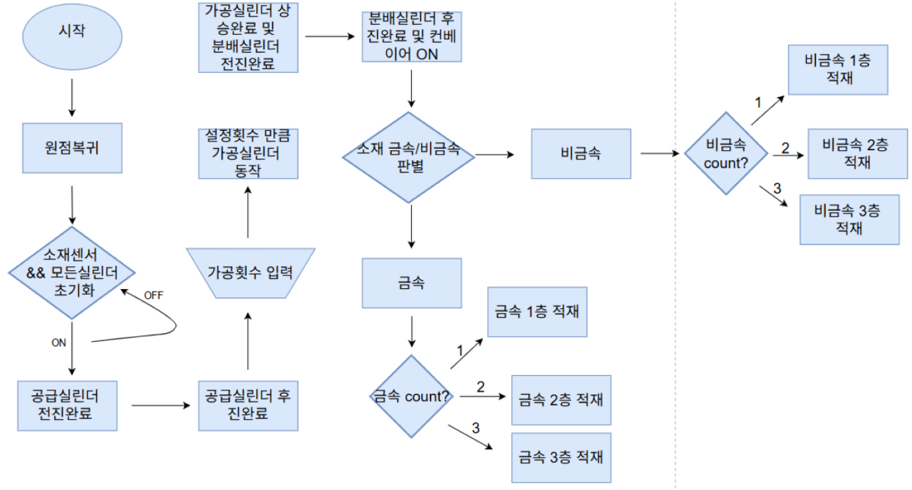
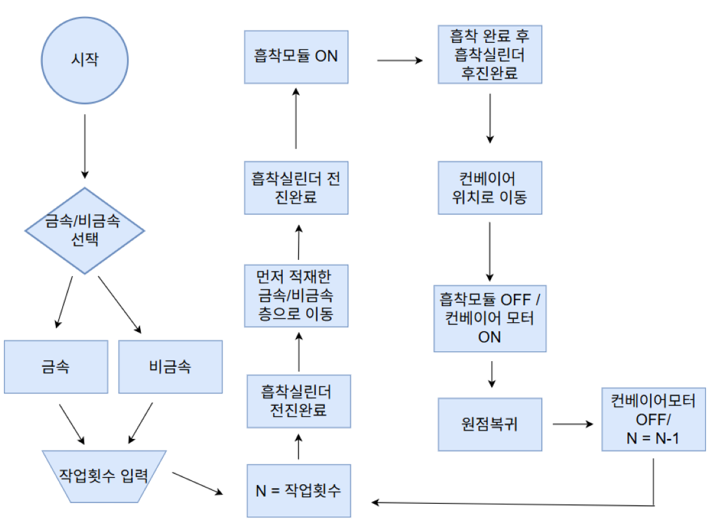
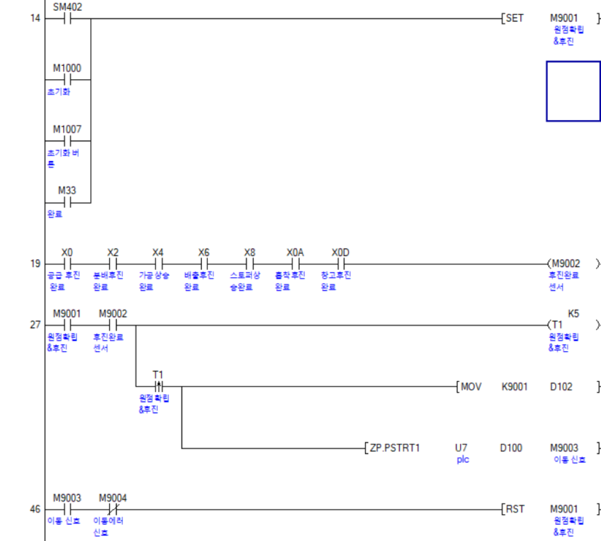
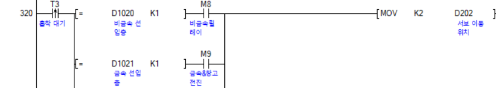
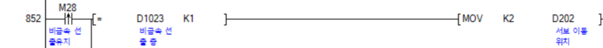
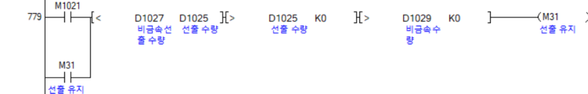
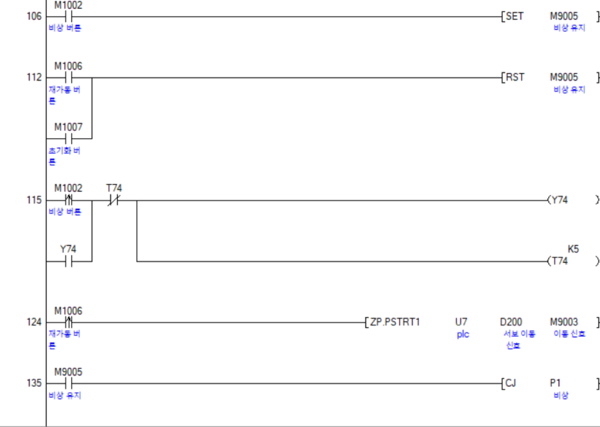

# 📦🔄 QPLC 기반 소재 판별형 자동 입출고 시스템 (QPLC-Based Automated Material Sorting System)

컨베이어 이동 중 Q PLC 기반 금속·비금속 소재 판별 및 적재 자동화 및
선입선출 구조로 소재를 입출고 하는 시스템 입니다.

---

## 📌 프로젝트 개요

- **수행 기간:** 2026.02.04 ~ 2026.02.09
- **사용 기술:**
  - GX Works 2 ver 1.631H
  - GS Designer 3 ver 1.2565
  - CDJ2B16-50Z-B 모터
  - CXSL10-50 모터
  - CR18-8DN 센서
  - PRL18-8DN 센서 
  - CDQ2B12-15DMZ 모터 
  - CDJ2KB16-100Z-B 모터
  - QD77MS2 모듈
  - MR-J4-10B 서보드라이버
    
- **주요 기능:**
  - 금속·비금속 소재 판별
  - 입고·출고 자동화
  - 선입선출 구조로 입출고

 ---
 
## 💻 개발환경

  
---

## 🛠 기술 스택

| 기술 | 설명 |
|------|------|
| GX works2 | 전체 시스템 코드 및 로직 구현 |
| GS Designer3 | HDMI 디스플레이 화면 구현 |
| CDJ2B16-50Z-B | 소재 공급 실린더 |
| CXSL10-50 | 소재 가공 실린더 |
| CR18-8DN | 근접센서 |
| PRL18-8DN | 금속감지센서 |
| CDQ2B12-15DMZ | 스토퍼 실린더 |
| CDJ2KB16-100Z-B | 소재 흡착 실린더 |
| Q03UDV | 사용한 CPU |
| QD77MS2 | 위치 결정 모듈 |
| MR-J4-10B | 서보드라이버 |

---

## 📋 기능 설명

### 1. 금속·비금속 소재 판별
- 금속 감지 센서가 감지되면 금속 판별 가능
- 근접 감지 센서가 켜지면서 금속 감지 센서가 켜지지 않을 경우 비금속 소재 판별 가능
 
### 2. 자동 입출고 및 선입선출 입·출고
- 컨베이어 이동 중 소재 판별 후 흡착 실린더, 창고실린더, 전후진 실린더를 이용하여 소재 입출고 가능
- 선입선출 구조로 코드를 구현하여 자동 선입선출 입출고 가능

### 3. 비상 버튼 구현
- 작업 중 비상버튼 클릭 시 모든 모터 정지
- 재가동을 누르면 다시 하던 작업을 이어서 가동
- 초기화를 누르면 모든 모터 초기상태로 복귀

### 4. 가공 횟수 지정 가능
- HDMI 화면에서 가공횟수 지정하여 가공실린더 횟수 지정 가능

---

## 🔄 플로우차트

### 입고 플로우차트

### 출고 플로우차트

---

## 📂 핵심 알고리즘

### [핵심 알고리즘 바로가기](https://github.com/ksi076/smart_road_management_system/tree/main/src)

---

## 🎥 시연 영상

### [인도 무단횡단 감지 시연](https://drive.google.com/file/d/1JJZ4wy2REE9QvrCth4uMI0Oh-UzQre7v/view?usp=sharing)
[]

### [차도 무단횡단 감지 시연](https://drive.google.com/file/d/10VPleeBBzlbaidgrZ4XxjRO3DYnDbJa4/view?usp=sharing)

### [불법 주정차 감지 시연](https://drive.google.com/file/d/1wICn6sA5SGs-cMUMmPEFmAYt1xEubBA2/view?usp=sharing)

### [불법 유턴 감지 시연](https://drive.google.com/file/d/1-yff9gF1twIYAe5XEUdBGuQiPEu5qhGJ/view?usp=sharing)

### [차량 횡단보도 침범](https://drive.google.com/file/d/1e-4tieU3bb9hKjmdHmfrGHj2JFM-pdN3/view?usp=sharing)

### [긴급상황 사고](https://drive.google.com/file/d/11_sgPJO63pYdR7drzoCO-xOwAlElfMGV/view?usp=sharing)

### [긴급 차 비켜주기](https://drive.google.com/file/d/1XEe5XvLOEKhPmtaGWWo1Pxdk5H6INKlp/view?usp=sharing)

---

##  💻  디스플레이 및 야간 LED 사진

  
  
  

### 1. 디스플레이 (XPT2046 Touch Controller)
- 라즈베리파이5와 연결하여 UI화면 제어

### 2. 야간 무단횡단 감지
- 보행자 빨간불 또는 신호상관 없이 횡단보도 외 도로 침범 시 네오픽셀 빨간LED 점등

### 3. 야간 차량침범 감지
- 보행자 초록불 신호에 차량이 횡단보도 침범 시 네오픽셀 파란LED 점등

---

## 💾  데이터베이스 사진

### 1. 데이터베이스 테이블

### 2. 데이터베이스 이미지

---

## ⚠️ 문제 해결 과정 (Trouble Shooting)

### 사례1

- **문제:** 빨간 사람 학습 후 신호등의 빨간 신호를 person클래스로 오탐  
- **해결:** 특정 ROI 영역 안의 person 감지를 continue하여 오탐 방지  

### 사례2

- **문제:** 낮과 밤을 묶어 vehicle 클래스를 학습시킨 결과 밤에 car를 인식하지 못함  
- **해결:** 낮과 밤을 클래스로 나눠 학습하여 해결 → vehicle, carnigh 클래스로 분류  

### 사례3

- **문제:** 카메라 2대를 사용하기 때문에 카메라 속도 유지를 위해 YOLO5n을 사용하자 인식하지 못함  
- **해결:** YOLO8s로 학습하여 인식못하는 문제를 해결하고 학습완료된 best.pt 파일을 best.onnx 파일로 교체하여 속도문제를 해결

### 사례4

- **문제:** 카메라 2대를 사용하기 때문에 카메라 속도 유지를 위해 YOLO5n을 사용하자 인식하지 못함  
- **해결:** YOLO8s로 학습하여 인식못하는 문제를 해결하고 학습완료된 best.pt 파일을 best.onnx 파일로 교체하여 속도문제를 해결
---

