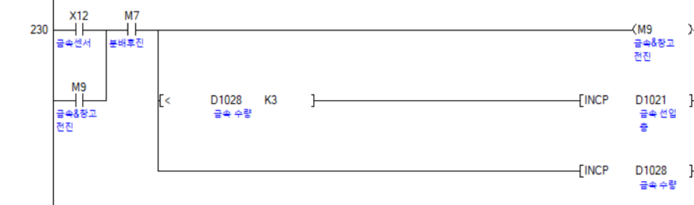

## 🧠 핵심알고리즘

---

### 1️⃣ 원점확립&후진


---

### 2️⃣ 선입

```python
def set_servo_angle(servo, angle):
    duty = 2 + (angle / 18)  # 각도를 PWM 신호로 변환 (서보모터는 각도를 직접받는게 아닌 PWM 듀비티를 받음)
    servo.ChangeDutyCycle(duty)                     #0도 -> 2, 90도 -> 7, 180도 -> 12
    time.sleep(0.5)  # 서보모터가 움직일 시간을 줌
    servo.ChangeDutyCycle(0)  # 서보모터를 멈춤
```
---

### 3️⃣ 선출

```python
capture = cv2.VideoCapture(0)
capture.set(cv2.CAP_PROP_FRAME_WIDTH, 360)
capture.set(cv2.CAP_PROP_FRAME_HEIGHT, 270)
```
---

### 4️⃣ 상태점검

```python
 qr = cv2.QRCodeDetector()  # openCV의 QR코드 검출기 객체 생성 (QR코드를 찾아주고, 안의 문자열도 읽어줌)
        data, box, straight_qrcode = qr.detectAndDecode(GRAY_frame) # data: QR안의 문자열, box: QR의 위치좌표, straight_qrcode : 보정된 QR이미지
```

---

## 🚨 안전설계

### 5️ 비상정지 회로

```python
  f qr_num[0:2] == "00":  # 광역자치단체 
                do = "서울특별시"     #(QR문자열 앞의 두자리가 00 이면)
            elif qr_num[0:2] == "03": 
                do = "인천광역시"     #(QR문자열 앞의 두자리가 03 이면)  
            elif qr_num[0:2] == "08":
                do = "경기도"        #(QR문자열 앞의 두자리가 08 이면) 
```
---

### 6️⃣ 후진완료 릴레이

```python
  if do == "경기도":
                    set_servo_angle(servo1, 90)  # 1번 서보모터를 90도로 회
                    time.sleep(5)
                    set_servo_angle(servo1, 0)   # 5초 대기후 원점복귀
                    
                elif do == "서울특별시":
                    set_servo_angle(servo2, 90)  # 2번 서보모터를 90도로 회전
                    time.sleep(5)
                    set_servo_angle(servo2, 0)   # 5초 대기후 원점복귀
```

### 7️⃣ InerLock 회로

```python
   reset_QR += 1   # 반복문이 한번 돌때마다 카운터 1증가
        if reset_QR == 96:  # 96이 되었을때 중복방지 리스트 초기화 (41ms마다 한번이기 때문에 약 4초마다 초기화)
            ex_data = []
```
---

## 🧾 전체코드
---


