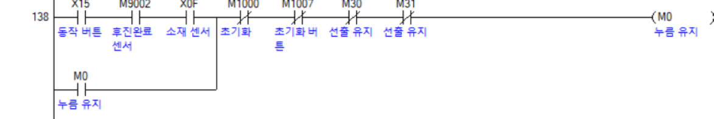

## 🧠 핵심알고리즘

---

### 1️⃣ 원점확립&후진

○ 시스템 시작 or 동작 종료 

-> 내부 릴레이 ON

-> 실린더 후진

-> 원점확립

-> 내부 릴레이 OFF

---

### 2️⃣ 선입

○ 소재인식

-> 층 수 증가

-> 설정된 층 입고

-> 동작종료 & 층수 = 3

-> 층 수 초기화

---

### 3️⃣ 선출

  
  
  

○ 버튼 누름

-> 층 수, 선출 수량 증가

-> 설정된 층 출고

-> 층수 = 3

-> 층 수 초기화

---

### 4️⃣ 상태점검

  
  
  

○ 버튼 누름

-> 적재 중 위치 학습

-> 동작 완료

-> 원하는 층 버튼 누름

-> 학습된 위치의 소재 출고

-> 소재를 공급

-> 출고된 위치에 다시 입고

---

## 🚨 안전설계

### 5️⃣ 비상정지 회로

  

○ 버튼을 누르면 SET으로 M9005를 유지

-> 재가동과 초기화를 선택할 수 있게 만들기 위해 SET을 통해 정지가 유지되게함

○ M9005가 ON이면 CJ를 통해 출력부로 이동

-> 재가동을 위해 B접점을 넣어 꺼버리는 것이 아닌 CJ를 넣어 CJ가 OFF되면 재가동할 수 있게함

○ 초기화를 위해 동작부분의 시작부에 B접점을 넣어 초기화 버튼을 누르면 신호가 OFF되게함

---

### 6️⃣ 후진완료 릴레이

  

○ 모든 실린더가 후진완료이면 M9005를 유지

-> 동작 조건에 M9005를 B접점으로 넣어 동작 중 에러 발생 방지

---

### 7️⃣ InerLock 회로

  

○ 각 동작에 B접점으로 다른 동작 시작을 넣음

-> 동작 중 다른 버튼을 눌러도 동작 하지 못하게 만들어 에러 방지

---

## 🧾 [전체코드보러가기](../doc/project_ladder.pdf)

---

