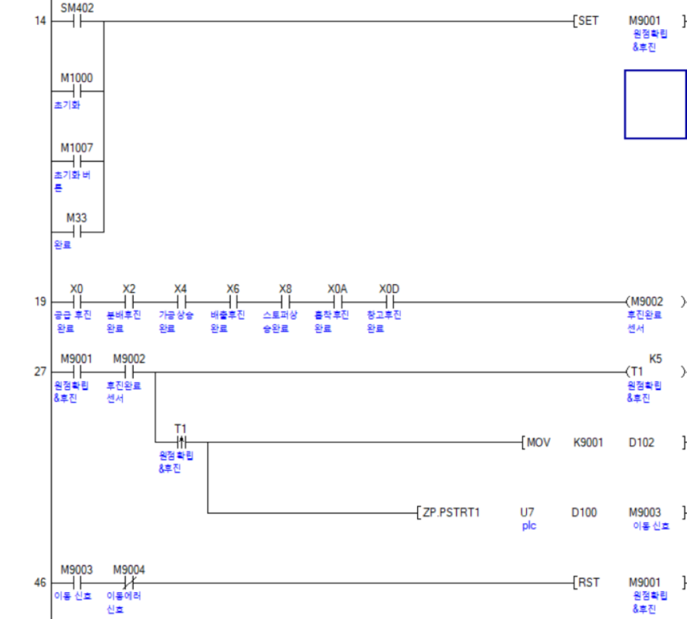
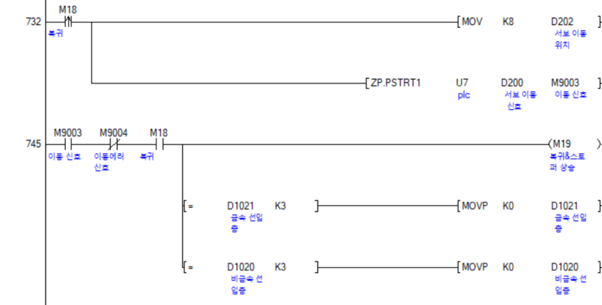
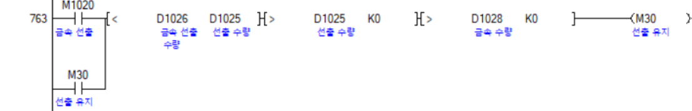
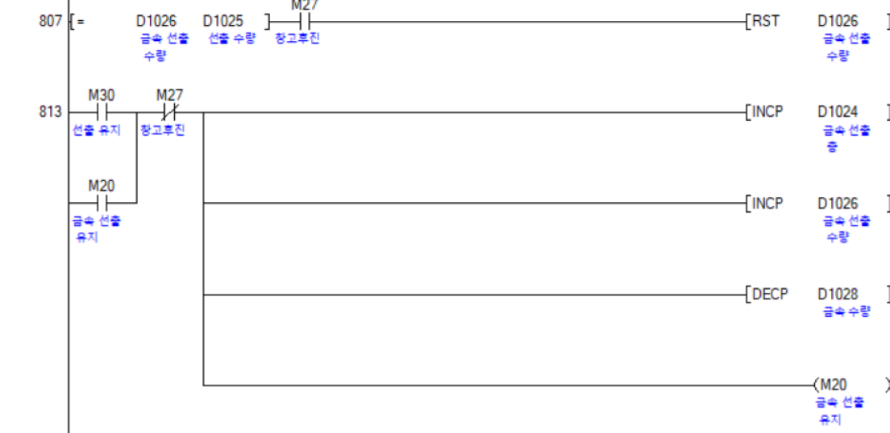
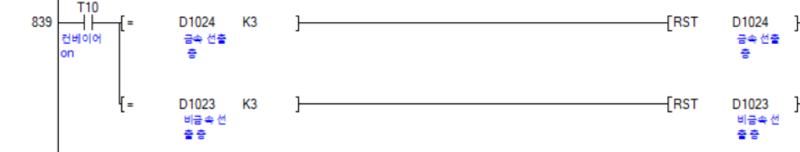
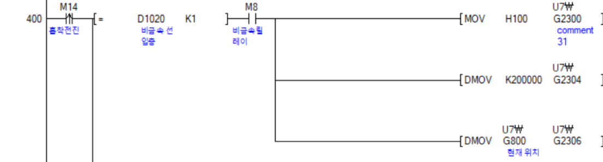
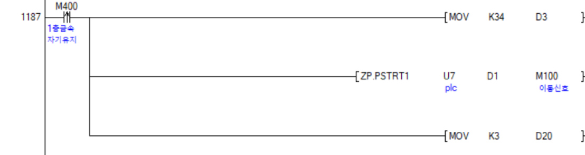
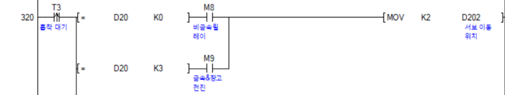

## 🧠 핵심알고리즘

---

### 1️⃣ 원점확립&후진



○ 시스템 시작 or 동작 종료 

-> 내부 릴레이 ON

-> 실린더 후진

-> 원점확립

-> 내부 릴레이 OFF

---

### 2️⃣ 선입




○ 소재인식

-> 층 수 증가

-> 설정된 층 입고

-> 동작종료 & 층수 = 3

-> 층 수 초기화

---

### 3️⃣ 선출





○ 버튼 누름

-> 층 수, 선출 수량 증가

-> 설정된 층 출고

-> 층수 = 3

-> 층 수 초기화

---

### 4️⃣ 상태점검





○ 버튼 누름

-> 적재 중 위치 학습

-> 동작 완료

-> 원하는 층 버튼 누름

-> 층 수 초기화

---

## 🚨 안전설계

### 5️ 비상정지 회로

```python
  f qr_num[0:2] == "00":  # 광역자치단체 
                do = "서울특별시"     #(QR문자열 앞의 두자리가 00 이면)
            elif qr_num[0:2] == "03": 
                do = "인천광역시"     #(QR문자열 앞의 두자리가 03 이면)  
            elif qr_num[0:2] == "08":
                do = "경기도"        #(QR문자열 앞의 두자리가 08 이면) 
```
---

### 6️⃣ 후진완료 릴레이

```python
  if do == "경기도":
                    set_servo_angle(servo1, 90)  # 1번 서보모터를 90도로 회
                    time.sleep(5)
                    set_servo_angle(servo1, 0)   # 5초 대기후 원점복귀
                    
                elif do == "서울특별시":
                    set_servo_angle(servo2, 90)  # 2번 서보모터를 90도로 회전
                    time.sleep(5)
                    set_servo_angle(servo2, 0)   # 5초 대기후 원점복귀
```

### 7️⃣ InerLock 회로

```python
   reset_QR += 1   # 반복문이 한번 돌때마다 카운터 1증가
        if reset_QR == 96:  # 96이 되었을때 중복방지 리스트 초기화 (41ms마다 한번이기 때문에 약 4초마다 초기화)
            ex_data = []
```
---

## 🧾 [전체코드보러가기](../doc/project_ladder.pdf)
---


